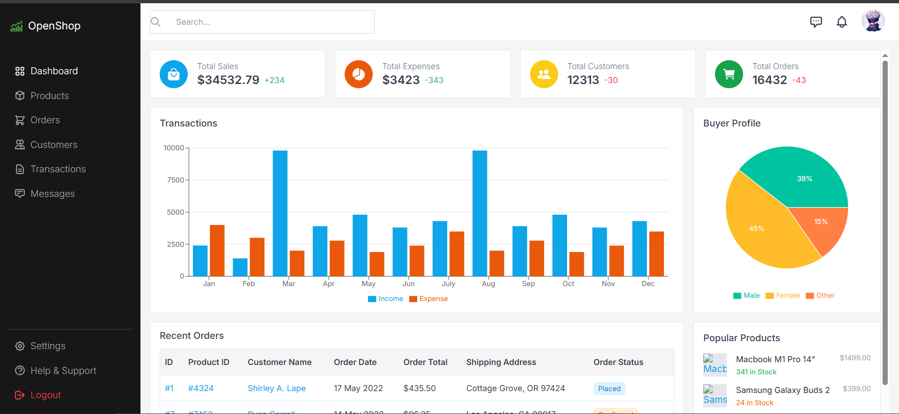

# Shopping App Dashboard (Frontend)

## Overview
- React 18 + Vite SPA for an admin-style shopping dashboard.
- Tailwind CSS for layout/utility styling, Recharts for data viz, Headless UI for accessible popovers/menus, React Router for routing.
- Includes summary KPI tiles, bar and pie charts, recent orders table, and popular products list.
- Sidebar + top search/header shell to extend with more routes (orders, customers, transactions, messages, settings, support).

## Project Structure
- shopping_app/ (Vite app root)
  - src/
	 - App.jsx (routes)
	 - components/
		- shared/Sidebar.jsx, Header.jsx, Layout.jsx
		- Dashboard.jsx (main page)
		- DashboardStateGrid.jsx, TransactionChart.jsx, BuyerProfileChart.jsx, RecentOrders.jsx, popularproducts.jsx
		- Products.jsx (placeholder products page)
	 - lib/const/navigation.jsx (sidebar link config)
  - public/Images/ (static assets)
  - tailwind.config.js, postcss.config.js, vite.config.js, eslint.config.js

## Getting Started
1) Prerequisites: Node.js 18+ and npm.
2) Install deps (run inside shopping_app):
	- npm install
3) Start dev server:
	- npm run dev
4) Build for production:
	- npm run build
5) Preview production build:
	- npm run preview

## Available Scripts (package.json)
- dev: Start Vite dev server.
- build: Create production build.
- preview: Serve the production build locally.
- lint: Run eslint (base config, React + hooks plugins).

## Routing
- `/` → Dashboard shell (Sidebar + Header) showing KPI cards, charts, tables.
- `/products` → Simple products placeholder with link back to dashboard.
- `/login` → Placeholder login page text.
- Sidebar links for orders, customers, transactions, messages, settings, support, logout are scaffolded via navigation config; add pages to activate.

## Key UI Pieces
- [Layout shell](shopping_app/src/components/shared/Layout.jsx): wraps sidebar, header, and outlet area.
- [Sidebar](shopping_app/src/components/shared/Sidebar.jsx) + [navigation config](shopping_app/src/lib/const/navigation.jsx): links and icons.
- [Header](shopping_app/src/components/shared/Header.jsx): search bar, message/notification popovers, avatar menu placeholders.
- [Dashboard](shopping_app/src/components/Dashboard.jsx): assembles the main widgets.
- [KPI grid](shopping_app/src/components/DashboardStateGrid.jsx): stat tiles with icons.
- [Transactions bar chart](shopping_app/src/components/TransactionChart.jsx): income vs expense by month.
- [Buyer profile pie](shopping_app/src/components/BuyerProfileChart.jsx): buyer distribution.
- [Recent orders table](shopping_app/src/components/RecentOrders.jsx): sample data with status pills (via [getOrderStatus](shopping_app/src/components/getOrderStatus.jsx)).
- [Popular products](shopping_app/src/components/popularproducts.jsx): list with stock/status coloring.

## Data & Assets
- Demo data for orders/products is hard-coded in component files; swap with API calls as needed.
- Avatar image in header references `/Images/gojo_sataru.png` (place your own asset or update the URL).
- Project hero snapshot: shopping_app/public/Images/image_of_shoppingapp.png (placeholder included).

## Styling Notes
- Tailwind is enabled via src/index.css (base layer sets typography, table styling, and link defaults).
- Components assume a neutral background and padded content area inside Layout.

## Extending
- Add real routes: create pages under src/components, export, and wire into App.jsx + navigation.jsx.
- Replace hard-coded arrays with fetched data; consider adding loading/empty states.
- Add auth/guarding for `/login` and other routes if needed.

## Troubleshooting
- If Tailwind classes do not apply, ensure npm install ran in shopping_app and that Vite dev server restarted after config changes.
- On Windows PowerShell, run npm scripts from shopping_app directory to avoid path issues.
